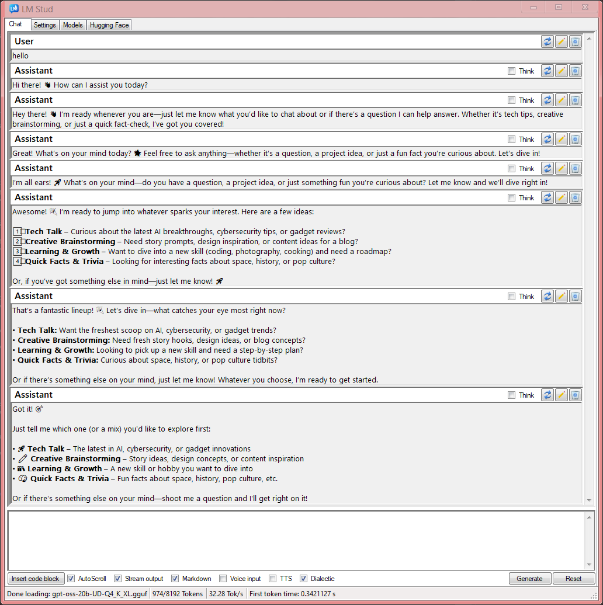
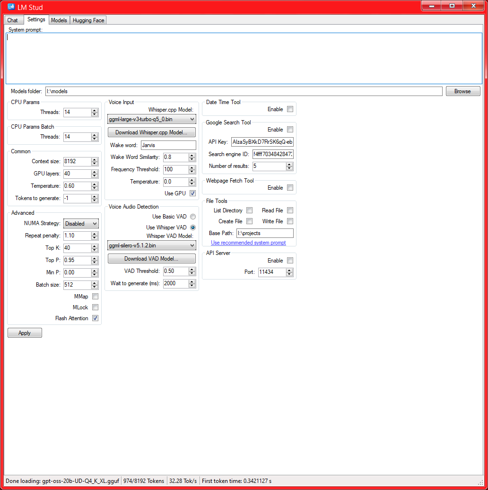
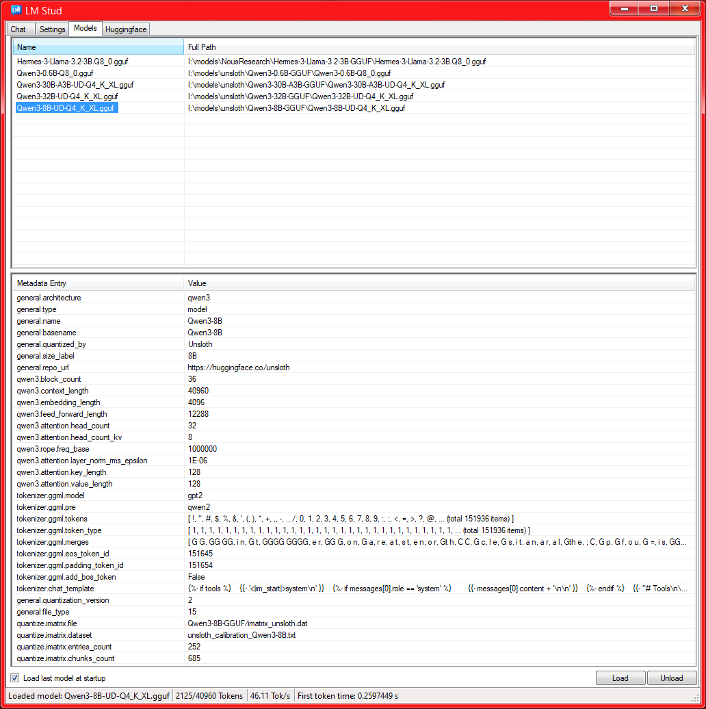
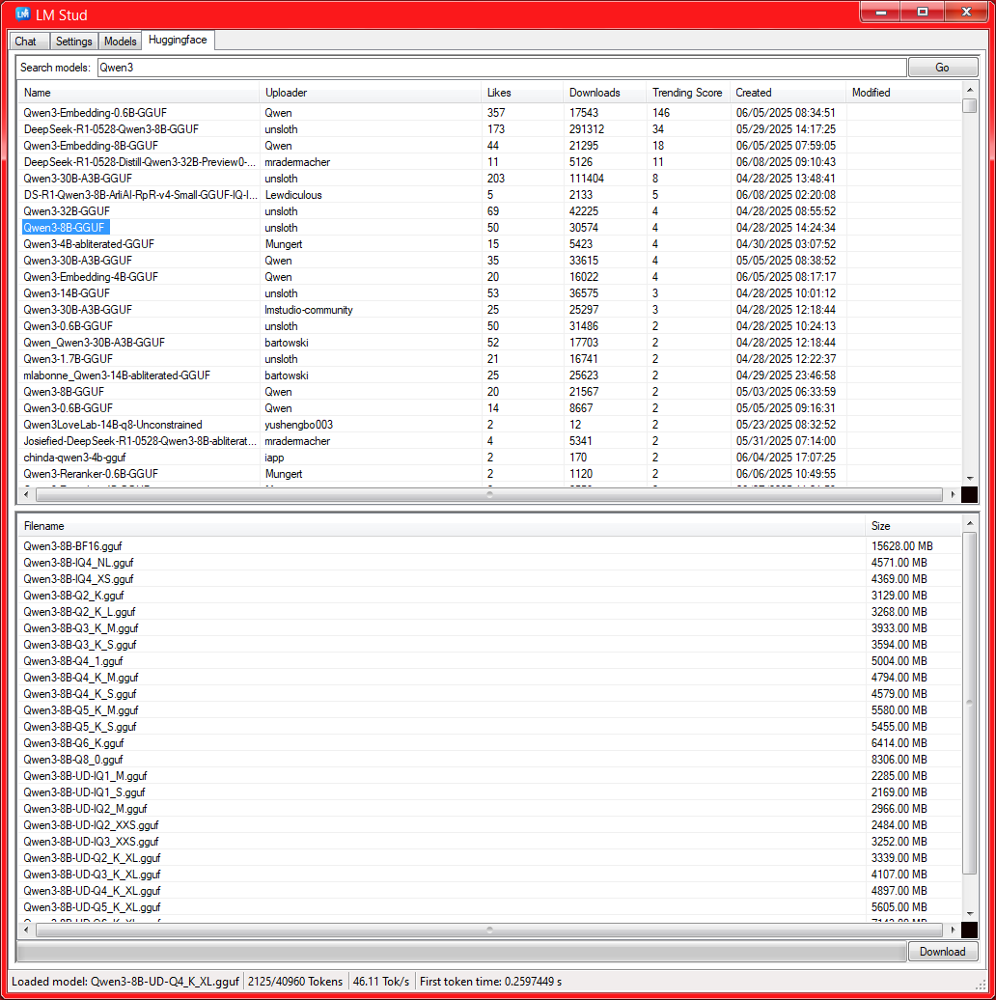

# 🦙 LM Stud – Local LLMs Minus the Lard

> **TL;DR**  
> A WinForms chat client for `llama.cpp`, `whisper.cpp` and your questionable life choices.  
> **Zero Electron. Zero telemetry. Zero regrets.**

---

## Features

| ☑️ | What It Does |
| --- | --- |
| ✅ | Launches in milliseconds—your GPU blinks and it’s already chatting. |
| ✅ | Edit / regenerate / yeet messages. |
| ✅ | Shows the model’s “thinking” stream (fun for prompt nerds). |
| ✅ | Drag-drop files → instant code blocks. |
| ✅ | One-click Hugging Face search & download. |
| ✅ | **Built-in Google Search + webpage fetch** (super-visible setup below). |
| ✅ | Optional speech I/O with `whisper.cpp`—talk smack to your computer. |
| ✅ | Tiny memory footprint—smaller than RGB keyboard driver. |

---

## Google Search – **READ ME FIRST** ⚠️

```text
1)  Grab an API key
    https://console.cloud.google.com/apis/dashboard
    → new project → enable “Custom Search API” → copy the key.

2)  Create a Search Engine ID
    https://programmablesearchengine.google.com/controlpanel/overview
    → “Add” → “Search the entire web” → grab the cx ID.

3)  Paste both values in  Settings → Tools → Google Search.
    Congrats—~100 free queries per day. Abuse responsibly.
```
---

## Screenshots

|             Chat Tab            |               Settings Tab              |              Models Tab             |                Hugging Face Tab               |
| :-----------------------------: | :-------------------------------------: | :---------------------------------: | :-------------------------------------------: |
|  |  |  |  |

---

## Quick-Start Build

```text
> clone https://github.com/CommanderLake/LMStud - obviously
> from a Visual Studio x64 native tools command prompt...
> E:\llama.cpp\build> cmake .. -DGGML_NATIVE=OFF -DGGML_BACKEND_DL=ON -DGGML_NATIVE=OFF -DGGML_AVX2=ON -DGGML_BMI2=ON -DGGML_CUDA=ON -DGGML_CUDA_F16=ON -DLLAMA_CURL=OFF -DLLAMA_ALL_WARNINGS=OFF -DLLAMA_BUILD_TESTS=OFF -DLLAMA_BUILD_TOOLS=OFF -DLLAMA_BUILD_EXAMPLES=OFF -DLLAMA_BUILD_SERVER=OFF
> or whatever bits and bobs you want
> copy common.lib llama.lib ggml.lib ggml-base.lib → $(SolutionDir)\lib\{Debug|Release}
> drop llama.dll, ggml*.dll & whisper.dll into the C# x64 bin folder
> vcpkg install SDL2:x64-windows-static
> vcpkg install curl[openssl]:x64-windows-static
> open LM Stud.sln in Visual Studio
> adjust VC++ Directories in Stud project
> build
```

---

## Settings Cheat-Sheet

| Section                | Knobs & Dials                                                  |
| ---------------------- | -------------------------------------------------------------- |
| **CPU Params / Batch** | Threads, strict pinning, batch threads.                        |
| **Common**             | Context size, GPU layers, temperature, tokens to generate.     |
| **Advanced**           | NUMA strategy, repeat penalty, top-k/p, batch size.            |
| **Voice**              | Model picker, wake word, VAD, frequency threshold, GPU toggle. |
| **Tools**              | Enable Google Search (API key + cx), enable webpage fetch.     |

---

## Contributing

* Fork it.
* Break it.
* PR it.
* Get internet points.
  (Memes optional but encouraged.)

---

## License

MIT—short, sweet and almost readable.
