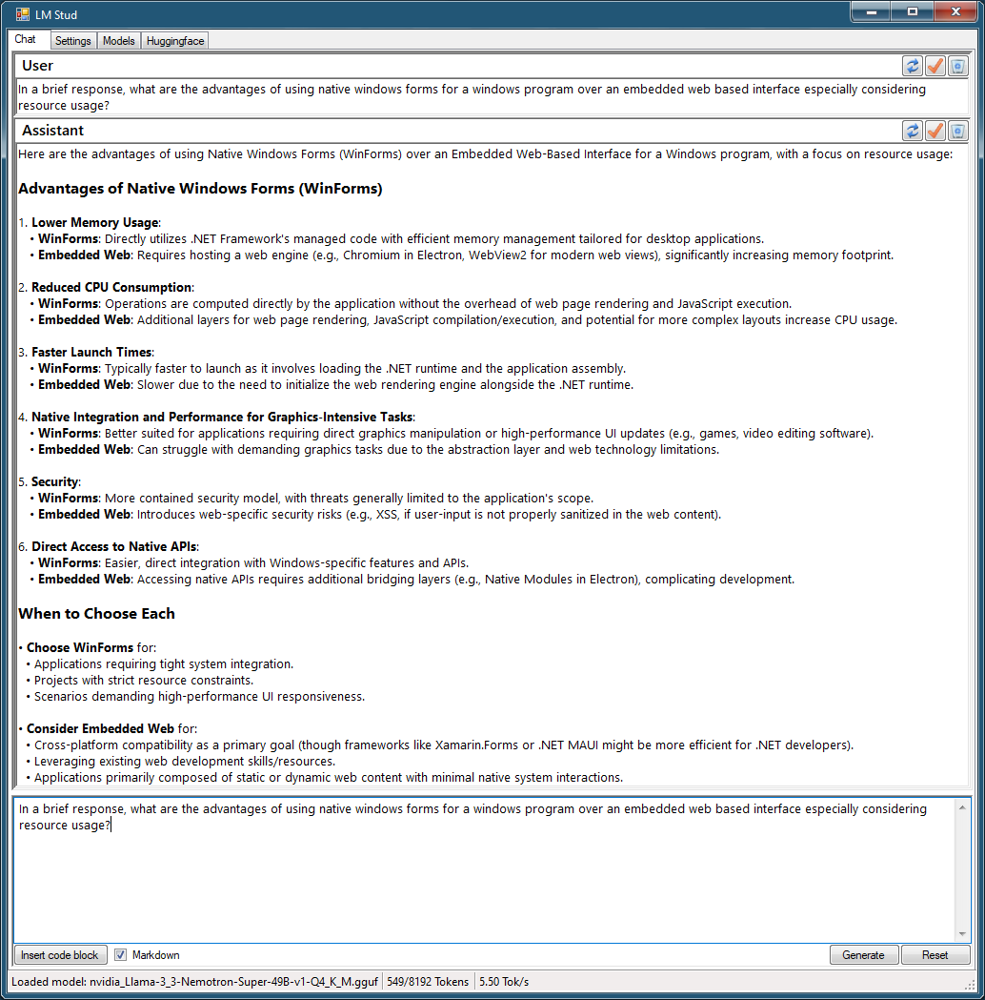

# LM Stud

LM Stud is a lightweight chat application for interacting with LLMs (Large Language Models) on Windows. Built using Windows Forms and llama.cpp, LM Stud avoids the bloat and high memory usage associated with embedded web-based interfaces, providing a streamlined, efficient and responsive GUI.

## Motivation

This project was born out of frustration with slow bloated embedded web-based GUIs that unnecessarily consume excessive resources. LM Stud offers a clean, efficient alternative, leveraging the power of Windows Forms in C# to minimize memory usage and maximize performance.

## Features

- Simple, intuitive Windows Forms-based chat interface
- Basic Markdown to RTF conversion for the RichTextBox
- Seperate display of the thinking process for thinking models
- Minimal resource usage compared to embedded web based GUIs
- NEW! Huggingface model search and download!
- EVEN NEWER! Voice prompting with Whisper.cpp and TTS!
- EVEN NEWERER!! Google search and webpage browsing tools!

(Out of date screenshot but you get the idea)

## Getting Started

### Prerequisites

- Visual Studio with C# and C++ development tools
- llama.cpp repository

### Building llama.cpp

1. Clone the [llama.cpp repository](https://github.com/ggerganov/llama.cpp).
2. Build llama.cpp with the following modules:
   - common
   - llama
   - ggml
   - ggml-base
   - Any additional backend you wish to include.

### Setting Up LM Stud

1. After building llama.cpp, gather the following generated `.lib` files from your build intermediate directory...
   - common.lib
   - llama.lib
   - ggml-base.lib

2. Place these `.lib` files in a directory such as `lib\release` or `lib\debug` within the LM Stud solution folder, matching your build configuration.
3. Modify the LM Stud project's VC++ Directories settings to include the paths to llama.cpp's include folders.
4. Copy the generated llama.cpp DLL files into the LM Stud project's output directory (`bin` folder), alongside the `LMStud.exe` file.
5. Do a similar thing for whisper.cpp (you only need whisper.dll and lib/includes it can use the llama.cpp backends).
6. Use vcpkg to install SDL2 and Curl with OpenSSL (`vcpkg install SDL2:x64-windows-static`, `vcpkg install curl[openssl]:x64-windows-static`) and set the Stud VC++ Directories to your vcpkg repository location.

### Running LM Stud

Once set up:

- Build and run the LM Stud project from Visual Studio.
- Ensure the necessary llama.cpp DLLs are present in the output directory.
- If you wish to use the Google Search Tool, configure these on the Settings tab:
1. Get your Google API key here for 100 free searches per day: https://console.cloud.google.com/apis/dashboard
2. Also required is a "Search engine ID" from Programmable Search Engine: https://programmablesearchengine.google.com/controlpanel/overview

## Contributing

Contributions to improve performance, usability and features are welcomed. Feel free to fork, enhance and submit pull requests!

## License

This project is released under the MIT License.
