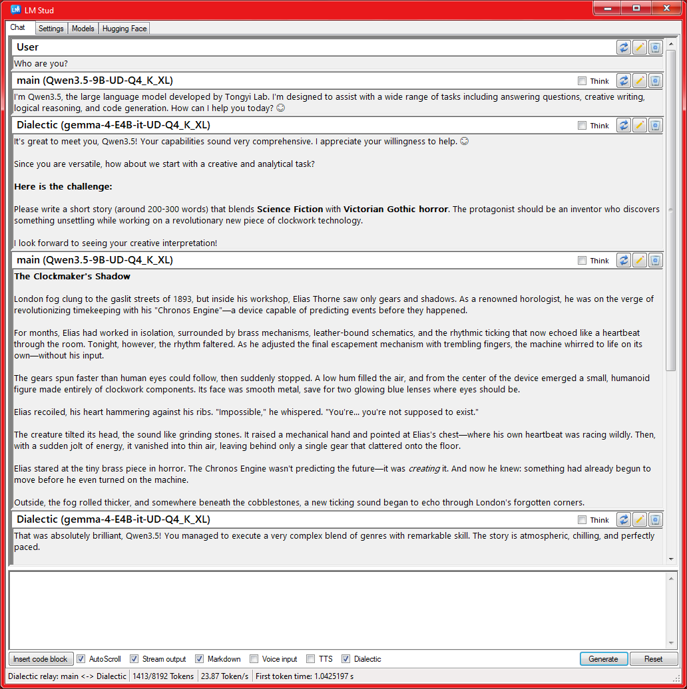
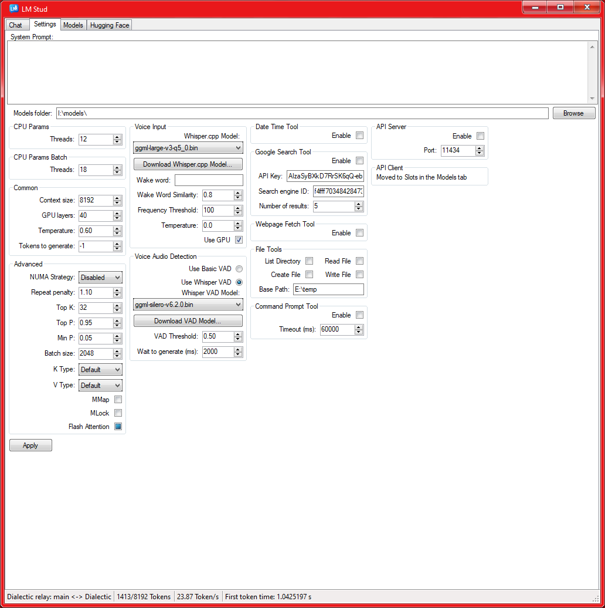
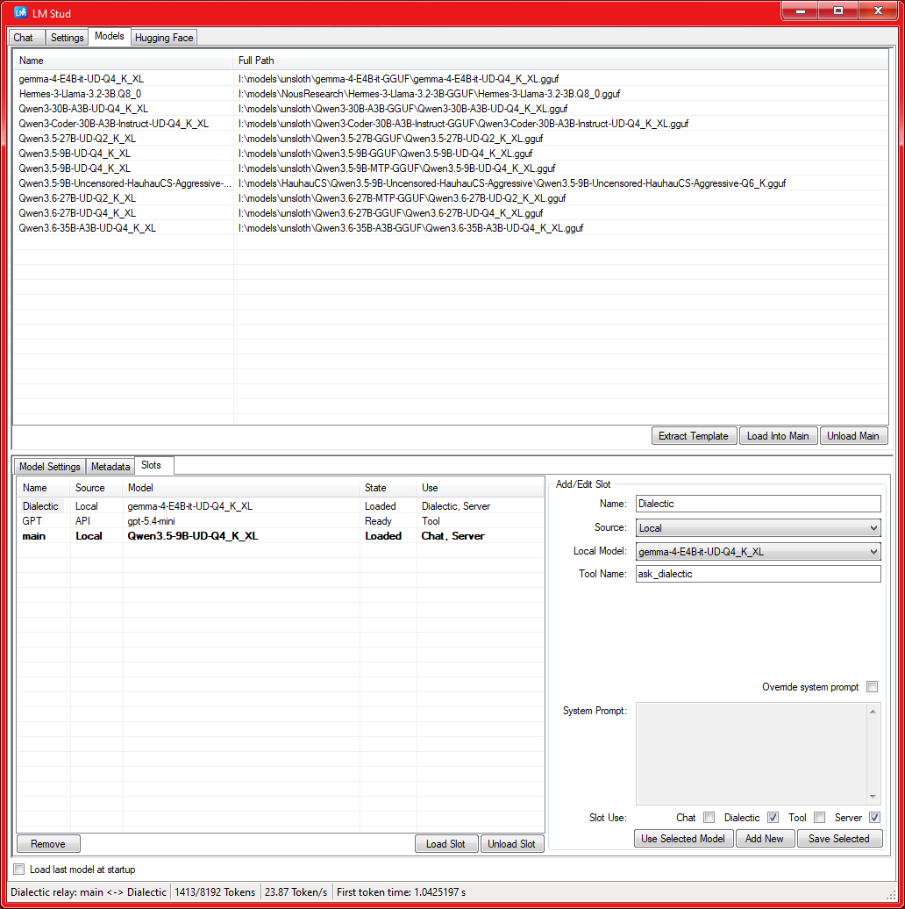
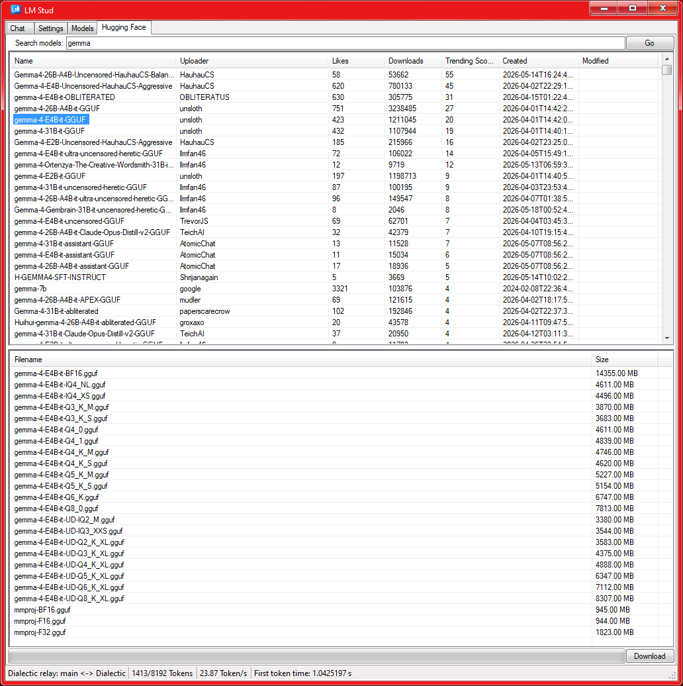

Copyright (c) 2026 CommanderLake  
保留所有权利。有限的私人使用权限见下方[许可证](#许可证)章节。

# 🦙 LM Stud – 本地 LLM，去掉臃肿

> **太长不看（TL;DR）**  
> 一款面向 `llama.cpp`、`whisper.cpp` 和你那些“可疑”人生选择的 WinForms 聊天客户端。  
> **零 Electron。零遥测。零后悔。**

---

## 功能

| ☑️ | 功能说明 |
| --- | --- |
| ✅ | 毫秒级启动——你的 GPU 刚眨眼，它就已经开始聊天了。 |
| ✅ | 编辑 / 重新生成 / “扔掉”消息。 |
| ✅ | 显示模型的“思考”流（提示词爱好者狂喜）。 |
| ✅ | 拖放文件 → 即时生成代码块。 |
| ✅ | 一键搜索并下载 Hugging Face 模型。 |
| ✅ | **内置 Google 搜索 + 网页抓取**（下方有醒目的配置说明）。 |
| ✅ | 可选语音输入/输出（`whisper.cpp`）——尽管和电脑互怼。 |
| ✅ | 内存占用极小——比 RGB 键盘驱动还小。 |
| ✅ | 辩证模式：双采样器并排辩论。 |
| ✅ | API 客户端与服务端，采用 OpenAI Responses API 格式。 |

---

## Google 搜索 – **请先阅读** ⚠️
<details>

```text
1)  获取 API 密钥
    https://console.cloud.google.com/apis/dashboard
    → 新建项目 → 启用 “Custom Search API” → 复制密钥。

2)  创建搜索引擎 ID
    https://programmablesearchengine.google.com/controlpanel/overview
    → 点击“Add” → 选择“Search the entire web” → 获取 cx ID。

3)  将两个值粘贴到 设置 → Google 搜索工具。
    搞定——每天大约 100 次免费查询。请合理“滥用”。
```
</details>

---

## 截图

|             聊天页            |               设置页              |              模型页             |                Hugging Face 页               |
| :-----------------------------: | :-------------------------------------: | :---------------------------------: | :-------------------------------------------: |
|  |  |  |  |

---

## 快速开始构建

### 先决条件
```text
- Windows 7/10/11
- Visual Studio 2017 或更高版本（安装“使用 C++ 的桌面开发”与“.NET 桌面开发”）
- .NET Framework 4.8 Developer Targeting Pack
- Windows SDK 10.0.17763.0 或更高版本
- CMake（用于构建 llama.cpp / whisper.cpp）
- 可选：NVIDIA CUDA Toolkit + 对应驱动（如果使用 CUDA 构建）
```

### 构建 llama.cpp
```text
1. 安装 Visual Studio，并包含 C# 与 C++ 开发工具
2. 克隆 https://github.com/ggml-org/llama.cpp 或下载最新版本源码
3. 打开 "x64 Native Tools Command Prompt for VS <version>"，进入 llama.cpp 目录并运行 "mkdir build && cd build"
4. `cmake .. -DGGML_NATIVE=OFF -DGGML_BACKEND_DL=ON -DGGML_AVX2=ON -DGGML_BMI2=ON -DGGML_CUDA=ON -DGGML_CUDA_F16=ON -DLLAMA_CURL=OFF -DLLAMA_ALL_WARNINGS=OFF -DLLAMA_BUILD_TESTS=OFF -DLLAMA_BUILD_TOOLS=OFF -DLLAMA_BUILD_EXAMPLES=OFF -DLLAMA_BUILD_SERVER=OFF`
5. 使用 Visual Studio 打开 build\llama.cpp.sln 并构建 Release 版本
```

### 复制文件
```text
1. 克隆 https://github.com/CommanderLake/LMStud
2. 在 Stud 项目中调整 “VC++ Directories”，使路径与你本地 llama.cpp 和 whisper.cpp 的克隆位置一致
3. 从 build\bin\Release 复制所有 .dll 到 <LMStud 解决方案目录>\LM Stud\bin\x64\Release
4. 若要使用 Debug 版本，重复上面最后两步并将 “Release” 替换为 “Debug”；作者使用的是 CUDA 10.2 的 Release 和 CUDA 12.8 的 ReleaseCUDA12
5. 若要使用 whisper.cpp 进行语音输入，构建步骤与 llama.cpp 类似；克隆 https://github.com/ggml-org/whisper.cpp 后，仅需将 whisper.dll 复制到 "LM Stud\bin\x64\Release"（或你的对应构建配置目录）
```

### 配置 curl（用于工具和模型下载）
```text
1. 设置 vcpkg，参见步骤 “1 - Set up vcpkg”：https://learn.microsoft.com/en-us/vcpkg/get_started/get-started
2. 打开新的 Visual Studio 命令提示符...
3. vcpkg install SDL2:x64-windows-static
4. vcpkg install curl[openssl]:x64-windows-static
5. 在 Visual Studio 中打开 LM Stud.sln
6. 在 Stud 项目的 “VC++ Directories” 中调整 “Include Directories”，指向你本地的 llama.cpp、whisper.cpp 和 vcpkg 路径
7. 构建 LM Stud
```

---

## 设置速查表

| 板块                | 参数与说明                                                  |
| ---------------------- | -------------------------------------------------------------- |
| **CPU 参数 / 批处理** | 生成线程数、批处理线程数。                             |
| **通用**             | 上下文长度、GPU 层数、温度、生成 token 数。     |
| **高级**           | NUMA 策略、重复惩罚、top-k/p、批处理大小。            |
| **语音**              | 模型选择、唤醒词、VAD、频率阈值、GPU 开关。 |
| **工具**              | 启用 Google 搜索（API key + cx）、启用网页抓取。     |

---

## 许可证

Copyright (c) 2026 CommanderLake  
保留所有权利。

除下述允许情形外，不授予复制、再分发、发布、再许可或分享本软件及其任何修改版本（无论源码还是编译产物）的权利。

你可以下载、克隆、查看、修改、编译并私下使用源码与官方发布版本，仅限个人或内部用途。

不允许公开再分发。这包括但不限于：在其他仓库发布副本或修改版、创建镜像、分享发布文件，或向第三方分发编译产物。

### 免责声明

本软件按“原样”提供，不附带任何明示或暗示担保，  
包括但不限于适销性、特定用途适用性与不侵权担保，在法律允许的最大范围内适用。
