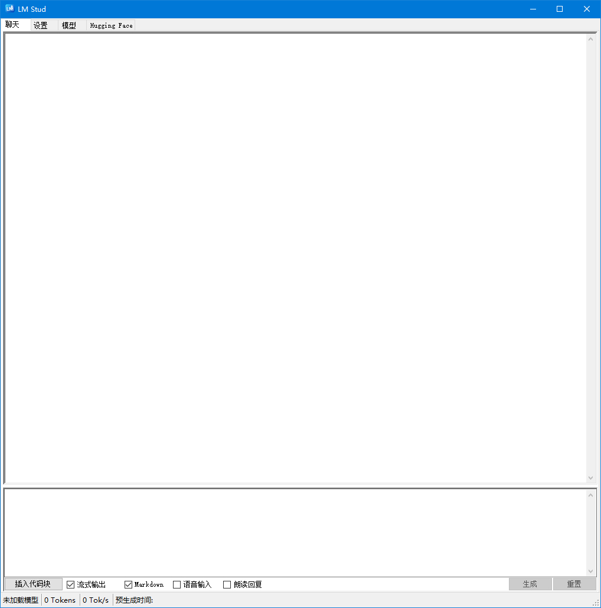

# 🦙 LM Stud – 精简的本地大语言模型

> **太长不看 (TL;DR)**  
> 一款为 `llama.cpp`、`whisper.cpp` 和你那些“可疑”人生选择打造的 WinForms 聊天客户端。  
> **零 Electron。零遥测。零后悔。**

---

## 功能简介

| ☑️ | 功能描述 |
| --- | --- |
| ✅ | 毫秒级启动——你的 GPU 刚眨眼，它就已经开始聊天了。 |
| ✅ | 编辑 / 重新生成 / “扔掉”消息。 |
| ✅ | 显示模型的“思考”流（提示词爱好者的福音）。 |
| ✅ | 拖放文件 → 即时生成代码块。 |
| ✅ | 一键搜索和下载 Hugging Face 模型。 |
| ✅ | **内置谷歌搜索 + 网页内容抓取**（设置方法见下方醒目位置）。 |
| ✅ | 可选使用 `whisper.cpp` 进行语音输入/输出——大胆和你的电脑“互怼”吧。 |
| ✅ | 内存占用极小——比你的 RGB 键盘驱动还小。 |

---

## 谷歌搜索 – **请先阅读** ⚠️
<details>

```text
1)  获取 API 密钥
    https://console.cloud.google.com/apis/dashboard
    → 新建项目 → 启用 “Custom Search API” → 复制密钥。

2)  创建搜索引擎 ID
    https://programmablesearchengine.google.com/controlpanel/overview
    → 点击“添加” → 选择“搜索整个网络” → 获取搜索引擎 ID (cx ID)。

3)  将这两个值粘贴到 设置 → 谷歌搜索工具 中。
    恭喜——每天约有 100 次免费查询。请合理使用。
```
</details>

---

## 软件截图

|             聊天界面            |               设置界面              |              模型界面             |             Hugging Face 界面             |
| :-----------------------------: | :-------------------------------------: | :---------------------------------: | :-------------------------------------------: |
|  |  |  |  |

---

## 快速构建指南

### 构建 llama.cpp
```text
1. 安装 Visual Studio，并包含 C# 和 C++ 开发工具
2. 克隆 https://github.com/ggml-org/llama.cpp 或下载最新版本的源代码
3. 打开 "x64 Native Tools Command Prompt for VS <version>"，进入 llama.cpp 文件夹，然后运行 "mkdir build && cd build"
4. `cmake .. -DGGML_NATIVE=OFF -DGGML_BACKEND_DL=ON -DGGML_AVX2=ON -DGGML_BMI2=ON -DGGML_CUDA=ON -DGGML_CUDA_F16=ON -DLLAMA_CURL=OFF -DLLAMA_ALL_WARNINGS=OFF -DLLAMA_BUILD_TESTS=OFF -DLLAMA_BUILD_TOOLS=OFF -DLLAMA_BUILD_EXAMPLES=OFF -DLLAMA_BUILD_SERVER=OFF`
5. 使用 Visual Studio 打开 build\llama.cpp.sln 并构建 Release 版本
```
### 复制文件
```text
1. 克隆 https://github.com/CommanderLake/LMStud
2. 将 build\common\Release\common.lib、build\src\Release\llama.lib、build\ggml\src\Release\ggml.lib 和 ggml-base.lib 复制到 <LMStud 解决方案文件夹>\lib\Release
3. 从 build\bin\Release 文件夹中，将所有 .dll 文件复制到 <LMStud 解决方案文件夹>\LM Stud\bin\x64\Release
4. 如果你想使用 Debug 版本，请重复最后两个步骤，但将 "Release" 替换为 "Debug"
5. 如果你想使用 whisper.cpp 进行语音输入，其构建步骤与 llama.cpp 类似 https://github.com/ggml-org/whisper.cpp，只需将 whisper.lib 和 whisper.dll 文件复制到相应的文件夹即可
```
### 设置 curl 用于工具和模型下载
```text
1. 设置 vcpkg，请参照步骤 "1 - Set up vcpkg": https://learn.microsoft.com/en-us/vcpkg/get_started/get-started
2. 在一个新的 Visual Studio 命令提示符中...
3. vcpkg install SDL2:x64-windows-static
4. vcpkg install curl[openssl]:x64-windows-static
5. 在 Visual Studio 中打开 LM Stud.sln
6. 在 Stud 项目的 "VC++ 目录" 中的 "包含目录" 里，将其调整为你本地的 llama.cpp、whisper.cpp 和 vcpkg 的路径
7. 构建 LM Stud
```

---

## 设置速查表

| 板块                | 可调参数                                                  |
| ---------------------- | -------------------------------------------------------------- |
| **CPU 参数 / 批处理** | 生成线程数、批处理线程数。                             |
| **通用参数**             | 上下文长度、GPU 层数、温度、生成 Token 数。     |
| **高级参数**           | NUMA 策略、重复惩罚、top-k/p、批处理大小。            |
| **语音**              | 模型选择、唤醒词、VAD（语音活动检测）、频率阈值、GPU 开关。 |
| **工具**              | 启用谷歌搜索（API 密钥 + cx）、启用网页内容抓取。     |

---

## 许可证

未授予任何许可证。保留所有权利。  
根据 GitHub 的服务条款，允许在 GitHub 上查看和派生（fork）代码。  
未授予其他任何权利；在 GitHub 之外的任何使用、再分发或修改都需要事先书面许可。

### 免责声明

本软件按“原样”提供，不附带任何形式的明示或暗示担保，  
包括但不限于对适销性、特定用途适用性及不侵权的担保，在法律允许的最大范围内适用。